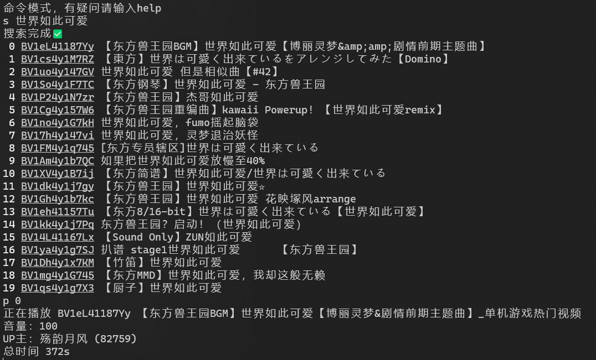

# BilibiliJustListening



## 如何使用

### build

```bash
git clone https://github.com/xyqlx/BilibiliJustListening
cd BilibiliJustListening
dotnet build -c Release
```

### 运行

```bash
cd BilibiliJustListening/bin/Release/net7.0
# or other net version
./BilibiliJustListening.exe
# maybe you need to follow the prompts to install playwright
```

### 命令

可以只输入命令的前缀

| 命令 | 说明 | 示例 |
| --- | --- | --- |
| help | 显示帮助 | help |
| exit | 退出程序 | exit |
| search | 根据关键词搜索视频 | search 宝石 |
| leftpage | 上一个搜索页 | leftpage |
| rightpage | 下一个搜索页 | rightpage |
| play | 从视频ID/视频链接/搜索结果序号/关键词播放视频 | play BV1TJ411a7WV |
| recommand | 显示当前推荐视频 | recommand |
| screenshot | 显示截图 | screenshot |
| latest | 显示UP主的最新视频 | latest 603474  |
| popular | 显示UP主的最热视频 | popular 603474 |
| time | 显示自上次开始播放的时间 | time |
| live | 进入直播间 | live 33989 |
| rank | 显示排行榜 | rank music |

## 配置文件

在可执行文件的同目录下创建`config.json`

```json
{
  "proxy": {
    "server": "http://example.com:8080",
  },
  "headless": true
}
```

如果不需要代理，可以不写`proxy`字段

headless为false时，会显示浏览器窗口便于调试

## 问题

### 验证码

跳转到网页可能需要输入验证码，特别是IP不在国内的情况下。目前无法处理这种情况

### 弹出登录窗口

这种情况会尝试自动关闭窗口，目前会导致播放卡一下

### 关于搜索页码

由于搜索结果会限制显示20项，所以相邻的搜索页可能并不是连续的

### 报错

习惯就好啦（
